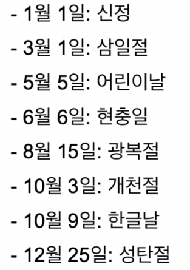

# 미션 - 개발자 비상근무 💻

- ### 미완성 ☑️
- ### 완성 ✅

```
<우택호> 배달 주문 서비스의 서버 개발을 맡고 있는 개발 팀장 수아는 한 가지 고민이 있습니다. 어떻게 하면 효율적으로 인력을 배치하여 장애를 탐지하고 신속히 대응할 수 있을지에 관한 것입니다.

얼마 전 항저우 아시안 게임과 같이 배달 주문이 급증할 것으로 예상되는 상황에 대비하여, 서비스 장애를 최소화하고 사용자의 불편을 줄이기 위해 경기 일정마다 개발자를 배치했습니다. 당시에는 비상 대응 인력이 부족해서 경기 일정마다 같은 인원이 반복적으로 대기할 수밖에 없었습니다.

다행히 이제는 비상 대응 인력이 확보되어, 본격적으로 효율적인 장애 대응을 준비하려고 합니다. 먼저 담당 개발자가 가장 빠르게 대응할 수 있도록, '월별 비상근무표'를 편성할 계획이에요. 매번 비상근무표를 만드는 데 들어갈 리소스를 줄이기 위해, 이를 자동화할 수 있는 시스템을 개발하려고 합니다.

아래의 요구사항을 충족하는 비상근무표 생성 프로그램을 만들어주세요.
```

```html
비상 근무를 배정할 월과 시작 요일을 입력하세요> 5,월
평일 비상 근무 순번대로 사원 닉네임을 입력하세요> 준팍,도밥,고니,수아,루루,글로,솔로스타,우코,슬링키,참새,도리
휴일 비상 근무 순번대로 사원 닉네임을 입력하세요> 수아,루루,글로,솔로스타,우코,슬링키,참새,도리,준팍,도밥,고니

5월 1일 월 준팍
5월 2일 화 도밥
5월 3일 수 고니
5월 4일 목 수아
...
```

### 비상 근무일 배정 규칙
- 기본적으로 순번에 따라 비상 근무일을 배정한다.
- 회사에서는 평일과 휴일(토요일, 일요일, 법정공휴일) 비상 근무 순번을 다르게 운영하고 있다.
- 평일 순번과 휴일 순번의 순서는 다를 수 있다.
- 비상 근무자는 평일 순번, 휴일 순번에 각각 1회 편성되어야 한다.
    - 잘못된 예시: 수아가 두 번 편성된 경우
      ```
      평일 순번: 수아, 루루, 글로, 솔로스타, 수아, 슬링키, 참새, 도리, 준팍, 도밥, 고니
      ```
- 근무자 보호와 비상 근무 운영의 효율을 위해, 비상 근무자는 어떤 경우에도 연속 2일은 근무할 수 없다.   
  순번상 특정 근무자가 연속 2일 근무하게 되는 상황에는, 다음 근무자와 순서를 바꿔 편성한다.    
  예를 들어, 수아가 평일인 목요일에 비상 근무를 서고, 다음 날인 금요일이 휴일이면서 순번상 또다시 수아가 근무해야 할 경우,    
  다음 휴일 근무자와 순서를 바꿔서 근무한다.
    - 예시)
        - 평일 순번: 준팍,도밥,고니,수아,루루,글로,솔로스타,우코,슬링키,참새,도리
        - 휴일 순번: 수아,루루,글로,솔로스타,우코,슬링키,참새,도리,준팍,도밥,고니
        - 근무 예시: 준팍(월요일),도밥(화요일),고니(수요일),수아(목요일),루루(금요일/휴일),수아(토요일/휴일),...


- 만약에 법정공휴일인 수요일에 수아가 비상 근무를 서고 다음 날 평일 순번이 수아인 경우에는,   
  다음 평일 근무자와 순서를 바꿔서 근무한다.
    - 예시)
        - 평일 순번: 준팍,도밥,수아,루루,글로,솔로스타,우코,슬링키,참새,도리,고니
        - 휴일 순번: 수아,루루,글로,솔로스타,우코,슬링키,참새,도리,준팍,도밥,고니
        - 근무 예시: 준팍(월요일),도밥(화요일),수아(수요일/휴일),루루(목요일),수아(금요일),루루(토요일/휴일),글로(일요일/휴일),...


- 비상 근무자 배정 시 다음 근무자와 순서를 바꿔야 하는 경우에는, 앞의 날짜부터 순서를 변경해야 한다.
---

---
## 📆 공휴일


---


## 💡 입력 조건

- ☑️ 비상 근무를 배정할 월과 시작 요일을 입력받는다.
    - 출력 : `비상 근무를 배정할 월과 시작 요일을 입력하세요> `
    - 입력 : `5, 월`
    - 단, 올바른 형식이 아닐 경우 예외 처리한다.

- ☑️ 평일 비상 근무 순번대로 사원을 입력한다.
    - 출력 : `평일 비상 근무 순번대로 사원 닉네임을 입력하세요> `
    - 입력 : `준팍,도밥,고니,수아,루루,글로,솔로스타,우코,슬링키,참새,도리`
    - 단, 올바른 형식이 아닐 경우 예외 처리한다.

- ☑️ 휴일 비상 근무 순번대로 사원을 입력한다.
    - 출력 : `휴일 비상 근무 순번대로 사원 닉네임을 입력하세요> `
    - 입력 : `수아,루루,글로,솔로스타,우코,슬링키,참새,도리,준팍,도밥,고니`
    - 단, 올바른 형식이 아닐 경우 예외 처리한다.

---


## 📚 기능 명세
- ☑️ 평일 순번과 휴일 순번의 순서는 다를 수 있다.
- ☑️ 비상 근무자는 평일 순번, 휴일 순번에 각각 1회 편성되어야 한다.
- ☑️ 근무자 보호와 비상 근무 운영의 효율을 위해, 비상 근무자는 어떤 경우에도 연속 2일은 근무할 수 없다.
- ☑️ 순번상 특정 근무자가 연속 2일 근무하게 되는 상황에는, 다음 근무자와 순서를 바꿔 편성한다.
  - 예를 들어, 수아가 평일인 목요일에 비상 근무를 서고, 다음 날인 금요일이 휴일이면서 순번상 또다시 수아가 근무해야 할 경우,    
    다음 휴일 근무자와 순서를 바꿔서 근무한다.
  - 만약에 법정공휴일인 수요일에 수아가 비상 근무를 서고 다음 날 평일 순번이 수아인 경우에는,   
    다음 평일 근무자와 순서를 바꿔서 근무한다.
- ☑️ 비상 근무자 배정 시 다음 근무자와 순서를 바꿔야 하는 경우에는, 앞의 날짜부터 순서를 변경해야 한다.
- ☑️ 연도는 고려하지 않으며, 매년 2월은 28일까지만 있다고 가정한다.
- ☑️ 비상 근무를 배정할 월과 시작 요일의 입력 값이 올바르지 않은 경우, '비상 근무를 배정할 월과 시작 요일'부터 다시 입력받는다.
- ☑️ 평일 순번 또는 휴일 순번의 입력 값이 올바르지 않은 경우, '평일 순번'부터 다시 입력 받는다.

---
## 💡 출력 조건
- ☑️ 평일이면서 법정공휴일의 경우에만 요일 뒤에 (휴일) 표기를 해야 한다.
- ☑️ 비상 근무표 출력을 완료하면 프로그램은 종료된다.

```
5월 1일 월 준팍
5월 2일 화 도밥
5월 3일 수 고니
5월 4일 목 수아
5월 5일 금(휴일) 루루
5월 6일 토 수아
5월 7일 일 글로
5월 8일 월 루루
5월 9일 화 글로
5월 10일 수 솔로스타
5월 11일 목 우코
5월 12일 금 슬링키
5월 13일 토 솔로스타
5월 14일 일 우코
5월 15일 월 참새
5월 16일 화 도리
5월 17일 수 준팍
5월 18일 목 도밥
5월 19일 금 고니
5월 20일 토 슬링키
5월 21일 일 참새
5월 22일 월 수아
5월 23일 화 루루
5월 24일 수 글로
5월 25일 목 솔로스타
5월 26일 금 우코
5월 27일 토 도리
5월 28일 일 준팍
5월 29일 월 슬링키
5월 30일 화 참새
5월 31일 수 도리
```

---
## ⚠️ Exceptions
### 📕 입력 Exceptions
- ✅ 닉네임이 중복될 경우 예외 처리
    - 입력 : `수아, 성훈, 동균, 성훈, 온콜`
    - 출력 : `[ERROR] 유효하지 않은 입력 값입니다. 다시 입력해 주세요.`
- ✅ 닉네임 길이가 5자가 초과될 경우 예외 처리
    - 입력 : `수아, 성훈, 동균, 김성훈김성훈`
    - 출력 : `[ERROR] 유효하지 않은 입력 값입니다. 다시 입력해 주세요.`
- ✅ 근무자가 5명 미만일 경우 예외 처리
    - 입력 : `수아, 성훈, 동균, 효성`
    - 출력 : `[ERROR] 유효하지 않은 입력 값입니다. 다시 입력해 주세요.`
- ✅ 근무자가 35명 초과일 경우 예외 처리
    - 입력 : `수아, 성훈, 동균, 효성, 수아2, 성훈2, 동균2, 효성2, 수아3, 성훈3, 동균3, 효성3, 수아4, 성훈4, 동균4, 효성4, 수아5, 성훈5, 동균5, 효성5, 수아6, 성훈6, 동균6, 효성6, 수아7, 성훈7, 동균7, 효성7, 수아8, 성훈8, 동균8, 효성8, 수아9, 성훈9, 동균9, 효성9,`
    - 출력 : `[ERROR] 유효하지 않은 입력 값입니다. 다시 입력해 주세요.`
- ✅ 올바르지 않은 근무자 입력 형식일 경우 예외 처리
    - 입력 : `성훈, 수아, 동균, 효성, 효성짱, 김성훈,, 김동균`
    - 출력 : `[ERROR] 유효하지 않은 입력 값입니다. 다시 입력해 주세요.`
- ☑️ 올바르지 않은 월, 시작 요일을 입력할 경우 예외 처리
    - 입력 : `오월, 일요일`
    - 출력 : `[ERROR] 유효하지 않은 입력 값입니다. 다시 입력 해주세요.`


---

### 📢 주의 사항
- JDK 17 버전에서 실행 가능해야 한다. **JDK 17에서 정상적으로 동작하지 않을 경우 0점 처리한다.**
- 프로그램 실행의 시작점은 `Application`의 `main()`이다.
- `build.gradle` 파일을 변경할 수 없고, 외부 라이브러리를 사용하지 않는다.
- [Java 코드 컨벤션](https://github.com/woowacourse/woowacourse-docs/tree/master/styleguide/java) 가이드를 준수하며 프로그래밍한다.
- 프로그램 종료 시 `System.exit()`를 호출하지 않는다.
- 프로그램 구현이 완료되면 `ApplicationTest`의 모든 테스트가 성공해야 한다. **테스트가 실패할 경우 0점 처리한다.**
- 프로그래밍 요구 사항에서 달리 명시하지 않는 한 파일, 패키지 이름을 수정하거나 이동하지 않는다.
- indent(인덴트, 들여쓰기) depth를 3이 넘지 않도록 구현한다. 2까지만 허용한다.
    - 예를 들어 while문 안에 if문이 있으면 들여쓰기는 2이다.
    - 힌트: indent(인덴트, 들여쓰기) depth를 줄이는 좋은 방법은 함수(또는 메서드)를 분리하면 된다.
- 3항 연산자를 쓰지 않는다.
- 함수(또는 메서드)의 길이가 15라인을 넘어가지 않도록 구현한다.
    - 함수(또는 메서드)가 한 가지 일만 하도록 최대한 작게 만들어라.
- JUnit 5와 AssertJ를 이용하여 본인이 정리한 기능 목록이 정상 동작함을 테스트 코드로 확인한다.
- else 예약어를 쓰지 않는다.
    - 힌트: if 조건절에서 값을 return 하는 방식으로 구현하면 else를 사용하지 않아도 된다.
    - else를 쓰지 말라고 하니 switch/case로 구현하는 경우가 있는데 switch/case도 허용하지 않는다.
- 도메인 로직에 단위 테스트를 구현해야 한다. 단, UI(System.out, System.in, Scanner) 로직은 제외한다.
    - 핵심 로직을 구현하는 코드와 UI를 담당하는 로직을 분리해 구현한다.
- 사용자가 잘못된 값을 입력할 경우 `IllegalArgumentException`를 발생시키고, "[ERROR]"로 시작하는 에러 메시지를 출력 후 예시를 참고하여 입력을 다시 받는다.
    - `Exception`이 아닌 `IllegalArgumentException`, `IllegalStateException` 등과 같은 명확한 유형을 처리한다.
